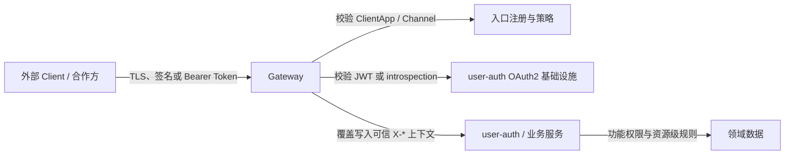

# 网关职责与信任边界

本文定义 cloud 系统中统一网关的目标职责、与 `user-auth` 及业务服务的边界，以及当前 `gateway` 工程的实现差距。该设计不依赖 Spring Cloud Gateway、Apache ShenYu 或其他具体产品；具体工程只是这组职责的一种实现。

认证领域、功能授权领域与登录会话语义见 [DOMAIN.md](DOMAIN.md)，ClientApp 与 Channel 语义见 [CLIENT_AND_CHANNEL_CONTEXT.md](CLIENT_AND_CHANNEL_CONTEXT.md)，OAuth2/OIDC 协议行为见 [OAUTH2_OIDC_PROTOCOL_INFRASTRUCTURE.md](OAUTH2_OIDC_PROTOCOL_INFRASTRUCTURE.md)。

## 核心结论

网关是外部请求进入内部服务前的**入口策略执行点和信任上下文生成者**，但不是认证领域或功能授权领域的所有者。

- 网关验证“请求是否来自允许的调用方”“Access Token 或 Browser Session 是否可接受”“请求是否允许进入该类端点”。
- 网关删除外部提交的受保护 Header，根据验证结果重新写入可信请求上下文。
- `user-auth` 负责账户、Credential、登录、LoginSession、Access/Refresh Token 签发与撤销，以及 Role/Permission 和渠道授权策略。
- 业务服务负责 `order:refund` 等功能权限的执行接入，以及资源归属、数据范围和领域状态规则。
- 网关只做粗粒度入口授权，不读取业务数据，也不替代业务服务的资源级鉴权。



## 一、网关必须承担的职责

### 1. 外部入口安全

网关或位于它之前的同一受控入口安全层必须完成：

- TLS 终止与安全协议配置；当前合作方服务端的强 Caller 认证使用请求签名。
- 签名覆盖 method、path、query、关键 Header、请求体摘要、timestamp 和 nonce，不能只签 `channelCode` 或业务单号。
- 当前合作方使用“一个 Channel 对应一个 Secret”时，gateway 仍必须以 `clientAppId + channelCode + keyId` 作为 CallerCredential 的查找范围，且签名同时覆盖 clientAppId 与 channelCode。所有 Request Signature 都必须携带公开 keyId，不再设计“平时可选、轮换时必填”的条件约束；keyId 不是 secret。验签成功后的 VerifiedCaller.channelCode 来自实际命中的凭据，不能直接复制请求参数。
- 校验 timestamp 窗口并原子防重放；nonce、外部一次性授权码或外部单号的重放语义应按协议分别建模。
- 限制请求体大小、Header 大小、HTTP 方法、Content-Type 和非法路径编码。
- 按 ClientApp、来源地址、用户、端点和失败类型实施限流、并发保护与必要的熔断。

若签名校验由独立 WAF、Ingress 或协议切面完成，网关可以消费其结果，但从公网到内部服务之间必须只有一个可审计的完整信任链，不能把“计划在上游校验”当作已完成校验。

### 2. ClientApp 与 Channel 入口校验

外部调用方提交 `clientAppId`、可选 `clientVersion` 和按端点要求提交的 `channelCode`。网关必须：

1. 查找受管理的 ClientApp，确认其存在且为 ENABLED。
2. 根据 ClientApp 配置推导 `platform`，不相信外部提交的 platform；一个 appId 唯一绑定一个不可原地迁移的 platform。
3. 校验 channelCode 存在、状态正常，并且该 ClientApp 允许进入该渠道。
4. 对明确要求渠道的端点拒绝缺少 channelCode 的请求；不需要渠道的管理端点不得强制要求渠道。
5. 将已验证结果写入下游 Header，而不是透传同名外部 Header。

`appId` 回答“哪个受管理应用或调用方在访问”，`channelCode` 回答“本次业务访问归属哪个渠道”，两者始终是独立维度。

### 3. OAuth2 Access Token 校验

对于需要宿主登录态的接口，网关是业务 API 的 OAuth2 Resource Server：

- JWT Access Token：验证签名算法、签名、`iss`、`aud`、`exp`、`nbf` 等声明，并限制可接受的 key 和算法。
- Reference Access Token：使用网关专属 confidential client 调用 introspection，要求 `active=true`，并校验返回的 issuer、audience、scope 和必要声明。
- 两种格式均从标准 `sub` 取得 UserId，从 `session_id` 取得 LoginSession 标识；任一缺失都拒绝进入需要宿主会话的接口。
- 两种格式都归一化 issuer、audiences 和 scopes，并验证当前 Endpoint 所需的 requiredAudiences/requiredScopes；面向其他资源服务器的 Token 不得进入当前 Endpoint。
- Token 格式是部署策略，客户端不能通过请求参数选择。
- 对同一请求只能建立一种明确的认证结果；不能在 Bearer Token 失败后退化为信任外部 `X-User-Id`。

JWT 采用离线校验时，网关无法立即感知已经登出的 Token，只能等待短期 `exp` 自然失效；Reference Token 通过 introspection 可以即时反映撤销。这是 Token 格式的安全与可用性取舍，不应由网关自行改变。

### 4. 粗粒度入口授权

网关根据路由元数据和 OAuth2 scope 执行粗粒度授权：

| 入口类别 | 网关要求 |
| --- | --- |
| 匿名认证入口 | 有效 ClientApp；按端点要求校验 Channel；不要求已有 User Session。 |
| 宿主业务入口 `/api/**` | 有效 ClientApp、有效 Bearer Access Token，以及端点要求的 Channel。 |
| H5 Browser 业务入口 | 有效 ClientApp、有效 Browser Session，以及端点要求的 Channel；不授予宿主或 admin authority。 |
| 管理入口 `/admin/**` | 有效 ClientApp、有效 Bearer Access Token，并具有 `SCOPE_admin`。 |
| OAuth2/OIDC 协议端点 | 路由到 Authorization Server，由协议安全链继续执行 OAuth2 client、grant、redirect URI、PKCE 等协议校验。 |
| Handoff ticket 兑换入口 | 有效 ClientApp；ticket 自身由下游原子校验，不要求宿主 Bearer Token。 |

网关的 scope 不是 Role 或 Permission。`SCOPE_admin` 只表示 Token 可以进入管理 API；Role、PermissionCode、直接授权、渠道来源授权和资源级规则仍由 `user-auth` 与业务服务负责。

### 5. 可信请求上下文生成

对于所有业务和管理路由，网关必须先删除调用方提交的受保护 Header，再用验证结果覆盖写入：

| Header | 可信来源 | 语义 |
| --- | --- | --- |
| `X-Client-App-Id` | IngressClientAppPolicy 验证结果 | 当前受管理应用/调用方。 |
| `X-Client-Platform` | 由 ClientApp 配置推导 | 当前应用接入形态，不能由调用方决定。 |
| `X-Client-Version` | 调用方声明，经格式和长度清洗 | 版本快照与审计维度，不是身份凭据。 |
| `X-Channel-Code` | IngressChannelAccessPolicy 校验结果 | 当前业务渠道；只在 IngressRouteAccessPolicy 需要或允许且组合合法时写入。 |
| `X-User-Id` | Bearer Token 的 `sub` 或 Browser Session 验证结果 | 当前认证 User，不得从外部 Header 或请求体取得。 |
| `X-Session-Id` | Bearer Token 的 `session_id` 或 Browser Session 关联的父 LoginSession | 当前 LoginSession，不得从外部 Header 或请求体取得。 |
| `X-Subject-Type` | gateway 的认证结果 | `HOST_SESSION` 或 `BROWSER_SESSION`；防止 Browser Session 被下游提升为宿主权限。 |

框架的 `ClientRequest`、`ChannelRequestContext` 和 `AuthenticatedSessionRequestContext` 只负责在下游 interfaces 层绑定这些 Header，本身不构成安全机制。Header 可信的前提是：

- 下游服务不能被公网或其他不受信任网络绕过网关直连。
- gateway 与内部服务共同位于当前定义的可信内网；内部服务间调用可以按现有约定传播受保护上下文。

Authorization Header 与 Cookie 必须分别配置转发策略。普通业务路由默认删除 Authorization 和全部 Cookie；OAuth2/OIDC 协议端点可以只保留 Authorization，Browser Session Cookie 在 gateway 验证后默认删除。Cookie 例外只能使用名称白名单，禁止以一个 PRESERVE 开关透传所有凭据。

### 6. 路由与协议隔离

网关负责：

- 根据稳定的 API 前缀和路由元数据把请求转发到目标服务。
- 区分 `/api/**`、`/admin/**`、`/oauth2/**`、`/.well-known/**` 与运维端点，避免使用一个通配规则混合不同安全策略。
- 只公开明确登记的 actuator 端点；管理和调试端点不得默认暴露到公网。
- 保持原始 method、path、query 和 body 语义，不在网关编排领域用例或改写业务字段。
- 为超时、重试和熔断设置与 HTTP 方法匹配的策略；非幂等写请求不得在没有幂等协议时自动重试。

gateway 的 EndpointCatalog 以 EndpointId 为身份，包含 ownerService、一组 `method + pathPattern` matcher 和逻辑 deliveryRouteId；infrastructure 再将 deliveryRouteId 映射为 SCG routeId。下游 interfaces 构建产物提供机器可读 EndpointManifest，只维护 endpointId 和 HTTP 契约；gateway 结合自身 `ownerService -> deliveryRouteId` 的 DeliveryRouteBinding 组装 Catalog。Catalog 记录 manifest 版本用于来源追踪，但整个运行快照只使用外层 snapshotVersion 做业务版本控制。过渡期可以先使用版本控制的 `config/endpoint-catalog.yml`。一个请求必须且只能匹配一个 EndpointId，每个公开 Endpoint 必须恰好存在一条 Route Policy。发布和启动都校验该契约，CI 再与 Controller/OpenAPI 做契约测试。Admin 策略接口不能临时创造 EndpointId 或物理 path。

### 7. 可观测性与安全审计

网关是全链路观测入口，必须：

- 接受合法的 W3C `traceparent`/`tracestate`，无有效上下文时创建新 trace；向下游传播同一 Trace Context。
- 生成或规范化 requestId，用于日志查询和面向调用方的故障关联；requestId 不是安全凭据，也不能替代 traceId。
- 记录 ClientApp、platform、channelCode、认证类型、UserId、SessionId、路由、状态码、耗时和限流结果；敏感标识应脱敏或受访问控制。
- 分别观测网关总耗时、下游耗时、JWT 校验耗时、introspection 耗时、连接池、重试和熔断。
- 不记录 Access Token、Refresh Token、authorizationCode、Cookie、Client Secret、完整签名原文或短信验证码。

SkyWalking 可以用于接口和下游调用链观测；安全审计仍需要结构化业务字段和独立留存策略，不能只依赖 trace span。

## 二、网关明确不承担的职责

| 不属于网关的职责 | 所有者 |
| --- | --- |
| 手机号验证码、外部授权码验证、Credential 绑定和账户合并规则 | `user-auth` 认证子域 |
| LoginSession 创建、绝对生命周期、续期策略和级联撤销 | `user-auth` 认证子域 |
| Access/Refresh Token 签发、rotation、reuse detection、JWK 与 OAuth2 授权记录 | `user-auth` OAuth2/OIDC 协议基础设施 |
| Role、Permission、直接授权和渠道授权来源叠加 | `user-auth` 功能授权子域 |
| `order:refund` 等功能权限的最终业务执行判断 | 对应业务服务，必要时消费 `user-auth` 授权能力 |
| 订单、家庭、组、Person 等资源归属和数据范围 | 拥有该资源的业务领域服务 |
| 商品、优惠券等按渠道隔离的数据规则 | 商城等业务领域 |
| Browser Session 的状态、初始签发、TTL 和父 LoginSession 级联撤销 | `user-auth` 认证会话能力 |
| Browser Session 的逐请求验证、受限入口授权和 Subject Type 传播 | gateway |

网关可以拒绝明显不具备入口资格的请求，但不能因为网关已经放行就让下游跳过领域鉴权。

## 三、与 `user-auth` 的协作契约

### 访问与登录

1. 匿名登录请求先通过 ClientApp、Channel 和入口签名检查。
2. `user-auth` 验证具体 Proof，创建或恢复 AuthAccount 和 LoginSession，并由 SAS 签发 Bearer Access Token。
3. 后续宿主请求由网关校验 Access Token，生成 `X-Subject-Type=HOST_SESSION + X-User-Id + X-Session-Id`；H5 请求校验 Browser Session 并生成对应的 `BROWSER_SESSION` 上下文。
4. `user-auth` 对高价值认证命令仍使用该组合回查 LoginSession，恢复 AuthAccount 并校验归属；不能只相信 UserId。

### 功能授权

网关只校验 OAuth2 scope。推荐的业务接口鉴权链为：

```text
网关验证 Access Token
  → 网关执行 endpoint/scope 粗授权
  → 业务服务检查 PermissionCode
  → 业务服务检查 Person/Group/资源数据范围
  → 业务聚合检查当前状态是否允许该动作
```

Permission 不应全部写进 JWT 并由网关独立判定，否则权限变更需要等待 Token 到期且会把功能授权领域规则固化在入口层。

### ClientApp 配置所有权

ClientApp 存在两类不同配置：

- 入口配置：enabled、platform、外部签名材料和限流策略；由 IngressClientAppPolicy 表达。
- 渠道入口组合：允许的 `ClientAppId + ChannelCode`；由 IngressChannelAccessPolicy 表达。
- 认证配置：renewalPolicy、OAuth2 scopes、外部身份 issuer 绑定等；由 `user-auth` 消费。

gateway 入口配置与 user-auth 认证配置共享同一个稳定 appId，但分别表达不同策略。当前两边都由各自的本地配置提供，发布流程必须做 appId 一致性校验；统一 ClientApp 主目录不属于当前实现范围。

当前不建设独立 Channel 主数据目录；`appId + channelCode` 合法组合由 gateway 的 IngressChannelAccessPolicy 表达。目标形态通过 gateway Admin API 维护和发布；当前代码仍由 infrastructure 本地配置提供。`user-auth` 只消费已验证 channelCode，并维护“该渠道作为授权来源时应授予哪些 Role/Permission”的功能授权策略。

`IngressClientAppPolicy`、`IngressChannelAccessPolicy` 和 `IngressRouteAccessPolicy` 都是 gateway 领域模型。Admin 可以只修改一类或一条策略，但每次都基于当前完整快照构造候选，装入受版本控制的 EndpointCatalog，完成全量校验后，通过 PolicySnapshotPublisher 发布一份同时包含 EndpointCatalog 和三类策略的完整 `IngressPolicySnapshot`：

- `IngressClientAppPolicy`：ClientApp 状态、唯一 platform、CallerCredential 和流量策略引用。
- `IngressChannelAccessPolicy`：`ClientAppId + ChannelCode` 的允许组合。
- `IngressRouteAccessPolicy`：EndpointId 对应的 execution mode、Caller/Channel/Subject Requirement、requiredScopes、requiredAudiences，以及相互独立的 Authorization/Cookie 转发策略。

当前没有不同审批人、发布权限或发布时间来证明三类策略需要独立发布，因此只维护一个递增的 `snapshotVersion`。发布端口额外使用 sourceRevision 做技术 CAS；Nacos adapter 可以用 content MD5，其他实现可以用 ETag 或 lockVersion。回退是把历史完整内容重新发布为更大的 snapshotVersion。运行时 Provider 获得新快照后重新验证完整 content，再原子替换本机内存引用；失败继续使用 last-known-good，首次启动没有有效快照则 fail-fast。

技术 adapter 的 watch/change notification 不是领域事件；当前没有独立业务消费者，不增加事件投影链路。Nacos 能较好匹配当前配置发布、监听和历史需要，是优先 adapter 而非目标形态。当前 gateway 工程仍使用本地配置；EndpointCatalog、完整快照模型和本地适配器应先完成，再接远程快照实现。

## 四、内部服务与 Job 调用

当前把内网作为一个整体可信网络，内部服务与 Job 不纳入 gateway 的入口身份领域：

- OpenFeign 内部调用可以直接访问目标服务，不要求再次经过 gateway。
- 代表当前用户继续调用时，按现有框架约定传播 Client、Channel、User、Session、Subject Type 和 trace 上下文。
- 目标接口要求 ClientApp 时继续使用已约定的内部 appId，但不额外引入 workload identity、service token、delegation token 或 on-behalf-of 协议。
- 外部流量仍必须经过 gateway，不能利用内部地址绕过入口策略。

该简化必须由平台/基础设施团队通过私网部署、禁止下游服务暴露公网 Listener/LoadBalancer，以及安全组、防火墙或 Kubernetes NetworkPolicy 仅允许 gateway 和明确授权 workload 访问来保证；部署验收和持续扫描需要检查规则漂移。若这些条件无法被证明，或未来内网包含不受控工作负载、第三方环境，就必须另行设计 workload identity 等零信任方案，不得继续把 Header 约定当作安全边界。

## 五、Browser Session 与 H5 流量

宿主使用 Bearer Access Token 创建 handoff ticket，H5 兑换后由服务端返回 `BROWSER_SESSION` HttpOnly Cookie。网关在该流程中的职责是：

- 创建 ticket 的请求按宿主受保护接口处理，校验 Bearer Token 并注入 UserId/SessionId。
- ticket 兑换入口允许匿名宿主会话，但仍校验 ClientApp、origin、限流和协议输入；ticket 的单次消费与父会话绑定由下游完成。
- 后续 Browser Cookie 请求由 gateway 的 `BrowserSessionAuthenticator` 在线验证。验证内容包括 Browser Session 状态、idle/absolute TTL 和父 LoginSession；具体通过 user-auth 在线验证接口还是共享 Session 存储 adapter 完成，由 infrastructure 决定。
- gateway 将验证结果归一为 `subjectType=BROWSER_SESSION + userId + sessionId`，覆盖写入 `X-Subject-Type`、`X-User-Id` 和 `X-Session-Id`。下游必须按 Subject Type 建立受限 authority，不能把它解释成 HOST_SESSION。
- Browser Session 需要滑动续期时，gateway 根据验证结果更新 `BROWSER_SESSION` HttpOnly Cookie；原始 Cookie 默认不继续转发到普通业务服务。
- Browser Session 不得获得 `SCOPE_admin`，也不得被转换成可以绑定 Credential、登出父 LoginSession 或创建新 handoff ticket 的宿主 authority。

当前 `gateway` 工程尚未实现 Browser Session 鉴权、`X-Subject-Type` 和 Cookie 滑动续期；这是已经确定的后续实现方向，而非待选架构方案。在这些能力补齐前，不能把普通 `/api/**` 的 H5 Cookie 请求视为已被 gateway 支持。

## 六、失败语义

| 场景 | 建议状态码 | 原则 |
| --- | --- | --- |
| 缺少或非法 ClientApp/Channel/入口签名参数 | `400` 或 `401` | 格式或组合非法用 `400`；调用方身份未建立用 `401`。 |
| Access Token 缺失、无效、过期或 inactive | `401` | 返回标准 `WWW-Authenticate: Bearer`，不泄露具体 Token 状态。 |
| Browser Session 缺失、无效、过期或父会话失效 | `401` | 清理无效 Cookie，不把失败降级成宿主或匿名权限继续访问受保护端点。 |
| Token 有效但缺少 endpoint scope | `403` | 已认证但无入口资格。 |
| 限流 | `429` | 提供受控的 `Retry-After`，不自动重试非幂等请求。 |
| 下游不可用或超时 | `502` / `503` / `504` | 保留 requestId/traceId，避免把下游异常统一伪装成业务失败。 |

对外错误体应稳定、无敏感信息；安全审计中可以记录更细的内部拒绝原因。

## 七、当前 `gateway` 工程评估

| 能力 | 当前状态 | 后续要求 |
| --- | --- | --- |
| user-auth 路由 | 已实现 | 将端点类别与安全策略做契约校验，避免硬编码漂移。 |
| JWT issuer/audience/JWK 校验 | 已实现 | 增加算法约束、密钥轮换与异常监控验证。 |
| Reference Token introspection | 已实现 | 补充超时、连接池、熔断、凭据轮换和可用性指标。 |
| `SCOPE_admin` 管理入口保护 | 已实现 | 保持它只表达协议入口资格。 |
| ClientApp enabled/platform/渠道组合校验 | 基础实现 | 拆分 ClientApp Policy、Channel Policy，并由 Route Policy 决定端点是否必须带渠道。 |
| EndpointCatalog | 未实现 | 优先建立 EndpointId、ownerService、matchers、deliveryRouteId 的映射和契约测试。 |
| 三类入口策略 | 尚未拆分 | 先实现一份完整本地快照，再通过 PolicySnapshotPublisher 发布同一结构；Nacos 是候选 adapter，不增加独立版本和事件投影。 |
| 受保护 `X-*` Header 删除并覆盖 | Bearer 场景已实现于 `/api/**`、`/admin/**` | 增加 `X-Subject-Type`，并评估默认移除下游 Authorization。 |
| 合作方签名、timestamp、nonce、防重放 | 未实现 | 在网关或其前置受控入口层完成并留审计证据。 |
| 限流、请求大小、超时、熔断治理 | 未实现 | 按路由与 ClientApp 配置。 |
| trace/requestId 与安全审计 | 未形成完整约定 | 接入 SkyWalking/W3C Trace Context 和结构化审计。 |
| 内部服务/Job 调用 | 可信内网直连 | 由私网、NetworkPolicy/安全组和禁止公网暴露提供强制边界；不满足则引入 workload identity。 |
| Browser Session/H5 专用路由 | 未实现 | 由 gateway 增加 BrowserSessionAuthenticator、受限 Subject Type 和 Cookie 滑动续期。 |

## 八、上线验收清单

- 外部无法绕过网关访问下游服务。
- 所有受保护 Header 都先删除再覆盖，缺少验证结果时绝不保留外部值。
- JWT 与 Reference Token 两种部署模式均校验 issuer、audience、有效期和必需声明。
- `/admin/**` 强制要求 admin scope；普通 `/api/**` 不以 admin scope 替代业务 Permission。
- ClientApp、platform、channelCode 的组合与端点必填规则有自动化测试。
- 合作方入口具备签名、timestamp、nonce、防重放和密钥轮换机制。
- 部署层保证外部不能进入可信内网或绕过 gateway 直连下游服务。
- 原始 Access/Refresh Token、授权码、Cookie 和密钥不会进入日志或 trace tag。
- 非幂等请求不会被无条件自动重试。
- H5 Browser Session 由 gateway 在线验证，并通过 `X-Subject-Type=BROWSER_SESSION` 保持受限权限，不会被当作宿主或 admin 会话。
- gateway 三类策略可以独立编辑，但只作为一个完整快照通过 sourceRevision CAS 发布、加载和以新 snapshotVersion 回退；具体快照技术可替换，并与 `user-auth` 的 appId 配置保持一致。
- 关键拒绝、introspection 故障、下游超时和限流均有指标与告警。
